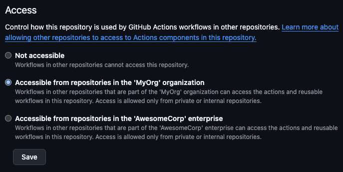

# Private Checkout

GitHub Action to check out another private repository in the same organization or enterprise.

This allows you to access files from another private/internal repository, without having to wire up PATs, GitHub Apps, or Deploy Keys. See the [detailed comparison](#comparing-different-approaches) and [this GitHub discussion](https://github.com/orgs/community/discussions/46566) for more context.

## Usage

**Step 1:** In the repository you want to check out, go to `Settings` -> `Actions` -> `General`, and set its `Access` to `Accessible from repositories in ...` the organization or enterprise.

**Step 2:** Then in another repository's workflow, add a step like this:

```yaml
- name: Check out private repo
  uses: jenseng/private-checkout@v1
  with:
    repository: MyOrg/my-private-shared-repo
```

This will check out `my-private-shared-repo` into the `$GITHUB_WORKSPACE` directory, allowing you to access any scripts/config/files needed for your workflow 🥳.

**Step 3** (optional): [Create a dummy action file](#can-i-disable-the-cant-find-actionyml-errors) in your private repository to suppress `Can't find 'action.yml'...` error messages.

## Configuration

### `repository`

Repository name with owner, e.g. `MyOrg/my-private-shared-repo`. Required.

The repository must either be:

- A private repository in the same organization
- An internal repository in the same enterprise
- A public repository ... but if that's the case that case you should just use [actions/checkout](https://github.com/actions/checkout) 😆

> [!IMPORTANT]
> Private/internal repositories must have their Actions Access set to `Accessible from repositories in ...` the organization or enterprise. [Learn more](#this-action-fails-with-failed-to-check-out--error-what-gives).

### `ref`

The branch, tag or SHA to check out. Defaults to `main`.

### `path`

Relative path under `$GITHUB_WORKSPACE` to place the repository.

### `action-path`

Subdirectory containing an `action.yml` or `Dockerfile`. You may want to set this in order to prevent confusing `Can't find 'action.yml', 'action.yaml' or 'Dockerfile' for action ...` errors. [Learn more](#can-i-disable-the-cant-find-actionyml-errors).

## Common Questions

### How does it work?

The [GitHub Actions runner](https://github.com/actions/runner) natively supports running actions from other private/internal repositories. In order to do that, it uses specially scoped access tokens to check out those repositories. This action relies on that functionality as follows:

- It generates a local composite action, with a step that [`uses` an action](https://docs.github.com/en/enterprise-cloud@latest/actions/reference/workflows-and-actions/workflow-syntax#jobsjob_idstepsuses) from the target repository. The action doesn't actually need to exist 🤯
- Then when the local composite action runs:
  - The runner downloads the files from the target repository, thanks to the `uses` reference
  - It skips the actual `uses` step (since we just want to download the files, we don't want to run an action from the target repository 😅)
- It copies the downloaded files into the target `path`.

### Why do I see `Can't find 'action.yml'...` errors?

This action [relies on](#how-does-it-work) the GitHub Actions runner's action download capability to check out the private repository. While this makes it possible to access private repositories without an additional access token, it can result in these error messages if the specified repository doesn't define a GitHub action. You can safely ignore these errors, but if you find them too annoying they are [easy to suppress](#can-i-disable-the-cant-find-actionyml-errors).

### Can I disable the `Can't find 'action.yml'...` errors?

Yes! While these errors don't cause any problems, they can be confusing. To suppress these error messages, you need to create a dummy `action.yml` or `Dockerfile` in your target repository. The `Dockerfile` can be empty, whereas `action.yml` needs to contain at least `runs: {"using": "node24"}`.

If you don't want to define one of these files at the root of your repository, you can put it in a subdirectory. Then when using this action you'll need to set [action-path](#action-path) accordingly.

### This action fails with `Failed to check out ...` error. What gives?

This error happens when your private/internal repository doesn't allow access to GitHub Actions from the calling repository. To fix this, go to your private repository's `Settings` -> `Actions` -> `General`, and set its `Access` to `Accessible from repositories in ...` the organization or enterprise. For example:



Note that this action **does not** support checking out private/internal repositories outside of this policy. For example, if you want to check out a private repository from another enterprise, you will need to use another approach like a [GitHub App](#github-apps).

## Comparing Different Approaches

### jenseng/private-checkout

You can use this action to check out a private/internal repository.

- 👍 Relatively simple
- 👍 Doesn't need to be rotated
- 👍 Access is controlled through existing Actions policies
- 👍 Only grants read-only access
- 👍 No tokens/credentials can be exfiltrated by a malicious GitHub Actions run
- 👎 Unless you [create a dummy action file](#can-i-disable-the-cant-find-actionyml-errors), you'll see confusing `Can't find 'action.yml', 'action.yaml' or 'Dockerfile' for action ...` error annotations

### PATs (Personal Access Tokens)

You can use a [Personal Access Token](https://docs.github.com/en/authentication/keeping-your-account-and-data-secure/managing-your-personal-access-tokens) (PAT) to check out a private repository.

- 👍 Relatively simple
- 👎 Tied to a specific user. If the user leaves the org, the token stops working
- 👎 Eventually expires, meaning you'll need to rotate it
- 👎 Potentially grants more access than is needed
- 👎 PAT can potentially be exfiltrated by a malicious GitHub Actions run

### GitHub Apps

You can use a [GitHub App](https://docs.github.com/en/apps/creating-github-apps/about-creating-github-apps/about-creating-github-apps) to acquire an access token, which you can then use to check out a private repository. This could be a simple GitHub App wired up with [actions/create-github-app-token](https://github.com/actions/create-github-app-token), or a 3rd-party one like [qoomon/actions--access-token](https://github.com/marketplace/actions/access-tokens-for-github-actions)

- 👍 Not tied to a user
- 👍 Doesn't need to be rotated
- 👎 More complex than a PAT
- 👎 Potentially grants more access than is needed
- 👎 Access token can potentially be exfiltrated from a malicious GitHub Actions run
- 👎 Depending on how your are minting/obtaining access tokens, the private key can potentially be exfiltrated by a malicious GitHub Actions run

### Deploy Keys

You can set up a [Deploy Key](https://docs.github.com/en/authentication/connecting-to-github-with-ssh/managing-deploy-keys#deploy-keys) to allow one repository to access another.

- 👍 Can be set to only grant read-only access
- 👍 Not tied to a user
- 👍 Doesn't need to be rotated
- 👎 Need to configure each repository independently
- 👎 More complex than a PAT
- 👎 Deploy key can potentially be exfiltrated by a malicious GitHub Actions run
